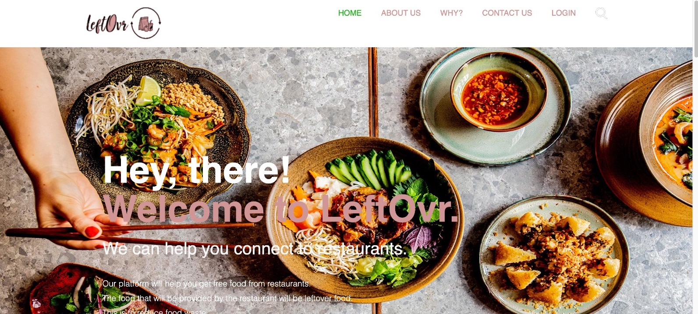

<h1> </h1>
<h1> About us </h1>


<p>Food waste has been a problem for ages. <br>
While many go hungry and even starve to death all around the world,<br>
others throw food away daily. <br>
We as individuals throw away food at home <br>
but restaurants and grocery stores also throw away a ton of food.<br>
--------<br>
Through this platform, we wish reduce atleast some amount of food waste <br>
by connecting individuals with restaurants.  </p>
# The Look

# Some Elements
* Home Page, About Us, Contact Us
* Learn Why we choose this project/brand purpose
* Sign up as a customer 
* Sign up a restaurant 
# Getting Started
  * Download Latest Version of Python 
  * Download PyCharm
  * Download Django
  * Download the things in requirement.txt

  After opening project in pycharm, on terminal run commands: 
  
  ``` 
  python manage.py runserver  
              or
  python3 manage.py runserver
  ```
# Developers
#### FrontEnd: 
```
   Susanna Arun
   Fahmida Chowdhury
  ```
#### BackEnd
```
  De'jon White 
  Omari King
  ```
   

 
